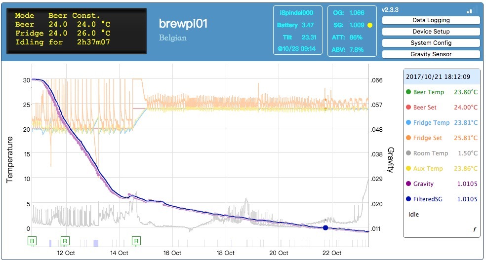

# BrewPiLess
 **Note: Beer Profile exteds to maximum 10 steps. Your setting might lost. There is an utility, /extra/backup.htm. You can upload this file and use it to backup/restore the settings.**

## Features
 * I2C LCD support.
 * Rotary encoder support (* not supported by default).
 * Remote LCD display on browser.
 * Remote temperature control.
 * Temperature schedule.
 * Device(temperature sensor and actuator) setup.
 * Temperature logging to specified **remote** destination. 
 * Web-based OTA firmware update.
 * Web-based network setting.
 * SoftAP mode.
 * Local temperature log and temperature chart.
 * iSpindel support. 
 * Gravity logging. The gravity data can be manually input or from iSpindel.
 * Gravity-based temperature schedule.
 * Save and resuse of beer profiles.
 * Static IP setting.
 * Export saved data to csv format by offline log viewer.
 * Brew and calibrate.
 * Tilt & Rapt Pill support(ESP32)
   
# Introduction
This project uses a single ESP8266 to replace RPI and Arduino.

BrewPi is the greatest, if not the ultimate, fermentation temperature controller. The original design uses a RPI to log temperatures and maintain a temperature schedule. The RPI also hosts a web server for the browser-based front-end. 
Using a RPI or a PC allows the maximum power of BrewPi to be used but requires additional hardware (namely a RPI or PC). 

ESP8266 is cheap and powerful WiFi-enabling IOT solution. 
Although it isn't as powerful as a RPI, it's a good solution to maximize the functionality and minimize the cost. Using a single ESP8266 as the temperature controller (replacing Arduino) and as the web server and schedule maintainer (replacing RPI) also reduces the work in building a brewpi system.

## !!Special Note
You will need to run the hardware setup procedure after upgrading to v2.4 from prior versions other than Glycol option enabled. Take a note of your configuration or save the options before you update the firmware so that you can recover the settings quickly.
 
## Known issues
* ESP8266 won't restart after saving system configuration.
 Sometimes ESP8266 can't restart after a software watchdog timer reset, which is the only way to reset the system by software. It happened on my NodeMcu and D1 mini boards that didn't connect to anything but USB. I have no solution for it.
* The page can't be loaded correctly.
 It rarely happens after HTTP caching is used, but it does happen especially when Javascript Console is opened. During developing and testing, I found corrupted html/javascript pages. Without the abliity and time to debug or develop the web server and or TCP/IP stack, I decide to live with it.
* Incorrect temperature chart.
 The log format before v2.0 is vulnerable. There seems to be some unconsidered conditions that break the log. 
* The gravity caluated by the controller is slightly different from that shown on chart. It is because the formula are derived speratedly. Due to different float precision, the formula is different. The difference should be small, though.

## Version History
 * 4.4
   * Settings might be reset, save it before updgrading.
   * (ESP32) Rapt Pill support
   * Revise Gravity Device Setting.
   * Removing confusing calibration temperature of wireless hydrometer
   * Code revise
   * update ESP32 framework to 6.3.2
 * 4.3.1 
   * Auto list device list on page open
   * Advanced settings for control constants.
   * Glycol as an option. No more dedicated Glycol build.
   * Update Filemanager.
 * 4.3
   * update ESP32 framework to 5.4.0
   * update ESP8266 framework to 4.2.0
 * 4.2.2
   * Dedicated GLYCOL support binary. Glycol chilling is NOT supported by default.
 * 4.2.1
    * [Only web front changes.] Show gravity changes of latest 48H/24H/12H instead of "stable". 
 * 4.2
    * BMP280 support
    * Using environment temperature as room/chamber temperature
    * extend maximum Beer Profile to 10 steps.
    * experimental Humidity control
    * Rotating LCD for extra information, like iSpiondel information, Humidity, and pressure.
    * Dedicated additional iSpindel display of SSD1306 OLED LCD.
    * New 'Write on buffer full' option for logging to reduce flash writing.
    * Backup/restore settings
    * LittleFS replaces SPIFFS for all ESP8266.
    * LittleFS is default for ESP32.
    * Partition table for ESP32 has changed. Flash via USB might be necessary.

 * 4.1
    * "Real" generic HTTP logging.
    * DHT1x/DHT2x support, for humidity control 
    * Pressure report for Brewfather.app
    * [ESP32] HTTPS remote logging.
    * [ESP32] TILT support
    *  Classic frontend is no longer maintained.

 * 4.0r1
    * Fix lost of WiFi connection after a few days.
 * 4.0
    * Arduino Framework 2.2.0
    * Pressure chart
    * [Prewssure transducer ADC refined. ADS1115 support.](doc/PresssureMonitor.md)
    * Display MAC address and Flash related information.

 * v3.6r3
    * Shorten recovering time. Resolving disconnection in AP mode for WiFi Auto Reconnect.
 
 * v3.6v2
    * Bug fixed: system config cann't be saved.
    * Bug fixed:DHCP service not availbe in AP_STA mode
 * v3.6
    * update framework to 2.2.0
    * **4m2m flash layout for All but SONOFF, due to size growth of framework.**
    * update OLED library to 4.0 (Not verified by me, but SOMEONE@HBT did report working)
    * update to ArduinoJson V6
    * add revised LCD page. at /lcd
    * SOFF OTA configuraton not longer available for space limit
    * Using interrupt for more responsive button operation.
    * MQTT publish/subscribe, NEW UI only.

 * v3.5.1 
    * fixed iSpindel temperature unit issue
    * update new OLED library(not verified)
    * The version number is still "3.5"

 * v3.5
    * MQTT Remote Control
    * Pressure transducer support
    * Add iSpindel WiFi signal if available, "Now" button in profile editing
    * "Fixed" incorrect time issue after restart.
    * Add DNS setting for static IP

 * v3.4
    * Add back STATAION mode only.
    * fixing Cap control tab display bug.
    * fixing blocking "Communication to BPL" dialog under AP mode

 * v3.3
    * LCD information push from server instead of request/response.
    * Replace ServerSideEvent by WebSocket. 
    * add Brazil Portugues support.

 * v3.2
    * Revise remote logging settings. Simpler interface and special process for ubidots.com.
    * Update to Arduino/ESP8266 framework 1.8.0

 * v3.1
    * Fix beer profile which uses gravity as conditions
    * Ditch WiFiManager.
    * AP mode is always avaible.
    * Plato supported
    * Spanish supported
    * Tom's frontend embedded.

 * v3.0
    * Avoid frequent access access of file system
    * Revise settings. Merge all settings into one file.
    * Applying temperature corection of iSpindel calibration informatoin.
    * Selective iSpindel calibration points.
    * Brew&Cal option moved to start of logs.
    * Merge classic HTML/JS files into grunt
    * Using push for beer profile information to reduce additional connection establishment. 
    * bug fixes.

 * v2.7
    * Cap(spunding) control
    * revise parasite temperature control

 * v2.6
    * fix the bug that don't save Gravity Device settings
    * write formula back to ESP8266 in brew and calibrate  mode
    * update temperature correction formula in brew and calibrate mode 
    
 * v2.5.1 
    * LCD backlight timer setting
    * support 2 buttons
    * merge Tom's front-end

 * v2.5 (2018/01/18)
    * optional: Latest ESP8266/Arduino framework w/ ESPAsyncTcp & ESPAsyncWebServer
    * revise network configuration and system config; change setting at "Config" page
    * fixed(static) IP bug fixed
    * fix redundant data requests
    * revise log resumption

 * v2.4.2x (2018/01/15)
    * Fix TILT zero display

 * v2.4.2 (2017/12/27)
    * bug fixed for resume display
    
 * v2.4.1 (2017/11/28)
    * URL to Format File System 
    * missing "Calculated by BPL" in v2.4
 
 * v2.4 (2017/11/09)
    * Brew and calibrate iSpindel.
    * Use iSpindel temperature reading as Beer Sensor.
    * Display tilt value of iSpindel.
    * Enhance SSE re-establishment
    * Default configurable minimum cooling/heating time & back-up sensor. (That is, Glycol supported.)
    * HTTP Port settings.

 * v2.3.3 (2017/10/08)
    * All HTML files can be replaced by files on SPIFFS. Gzip support.
    * updated HTML/JS
    * Add "Title" to be displayed at banner in config page.
    * Workaround for accepting HTTP Post body length not equal to Content-Length.( for iSpindel v5.2+)

 * v2.3.2
    * Beer Profile scheculde bug fix
    * Show hostname at banner
 * v2.3.1
    * WiFi signal
    * /getstatus web service
 * v2.3
    * Fix error in time of reset. (New log format! Use new log viewer)
    * State coloring in chart
    * Remove "view" action in log list.
 * v2.2
    * 4 decimals of gravity
    * Switch to PlatformIO instead of Arduino IDE.
 * v2.1
    * more gravity-based condition 
 * v2.0
    * gravity-based beer profil schedule
 * v1.2.7
    * iSpindel support 

# Software configuration

If you want to build the BrewPiLess firmware by yourself, we strongly recommend using platformIO and VisualStudio Code with the PlatformIO IDE extension.

You can find further details in the wiki: [Software Installation](https://github.com/vitotai/BrewPiLess/wiki/Software-Installation).

# wiki

* [Hardware Setup](https://github.com/vitotai/BrewPiLess/wiki/Hardware-Setup)
  * [Example#1](https://github.com/vitotai/BrewPiLess/wiki/Hardware-Setup-example)
  * [SONOFF](https://github.com/vitotai/BrewPiLess/wiki/SONOFF)
  * [Thorrax’s Board](https://github.com/thorrak/brewpi-esp8266)
* [Software Installation](https://github.com/vitotai/BrewPiLess/wiki/Software-Installation)
  * [Software Configuration](https://github.com/vitotai/BrewPiLess/wiki/Software-Configuration)
* [Initial WiFi Setup](https://github.com/vitotai/BrewPiLess/wiki/Initial-WiFi-Setup)
* [System Setup](https://github.com/vitotai/BrewPiLess/wiki/System-Setup)
  * [SoftAP mode](https://github.com/vitotai/BrewPiLess/wiki/SoftAP-mode)
* [Device Setup](https://github.com/vitotai/BrewPiLess/wiki/BrewPi-Device-Setup)
* [Temperature Logging](https://github.com/vitotai/BrewPiLess/wiki/Temperature-logging,-locally)
* [Cloud Logging](https://github.com/vitotai/BrewPiLess/wiki/Log-data-to-clouds)
  * [Log to Google Spreadsheet](https://github.com/vitotai/BrewPiLess/wiki/Log-data-to-Google-Spreadsheet)
* [Beer Profile](https://github.com/vitotai/BrewPiLess/wiki/Beer-Profile)
* [iSpindel Support](https://github.com/vitotai/BrewPiLess/wiki/iSpindel-Support)
  * [Brew and Calibrate](https://github.com/vitotai/BrewPiLess/wiki/Brew-and-Calibrate-iSpindel)
  * [iSpindel as Beer Sensor](https://github.com/vitotai/BrewPiLess/wiki/Using-iSpindel-as-Beer-Temperature-Sensor)
* [Manual Gravity Logging](https://github.com/vitotai/BrewPiLess/wiki/Manual-Gravity-Logging)
* [Use with Glycol](https://github.com/vitotai/BrewPiLess/wiki/Use-with-Glycol)
* [Other URLs](https://github.com/vitotai/BrewPiLess/wiki/Other-URLs)
  * Clear WiFi setting
  * Format file system
  * OTA update
* [Overwrite pages](https://github.com/vitotai/BrewPiLess/wiki/Overwrite-web-pages)
* [JSON Commands](https://github.com/vitotai/BrewPiLess/wiki/JSON-command)
  * Temperature Unit
  * Sensor Calibration
* [FAQ](https://github.com/vitotai/BrewPiLess/wiki/FAQ)
