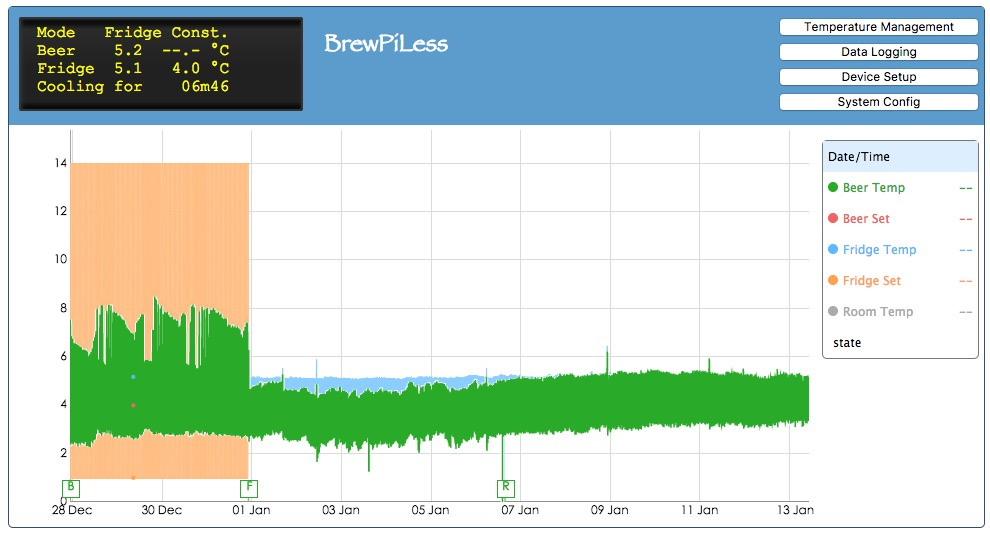
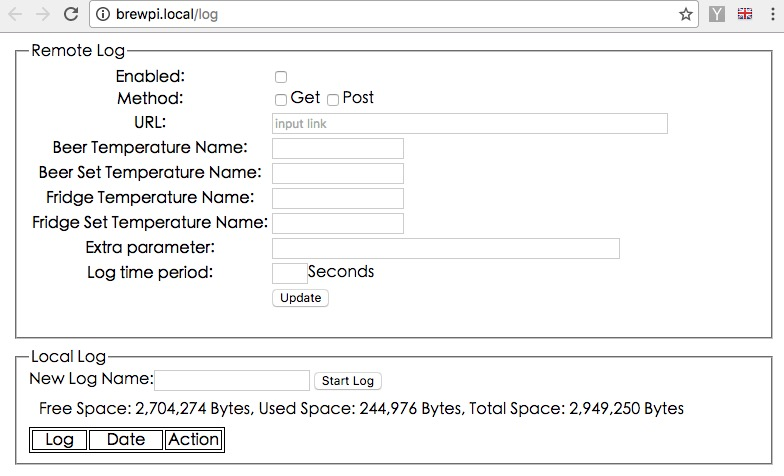

# BrewPiLess
## Introduction
This project uses a single ESP8266 to replace RPI and Arduino.

BrewPi is the greatest, if not ultimate, fermentation temperature controller. The original design uses a RPI to log temperatures and maintain temperature schedule. The RPI also hosts a web server as the front-end of internet web access. 
Using a RPI or a PC enables the maximum power of BrewPi in the cost of additional RPI or PC. 

ESP8266 is cheap and powerful WiFi-enabling IOT solution. 
Althoug it can't be as powerful as a RPI, it's a good solution to maximize the functionality and minimize the cost. Using single one ESP8266 as temperature controller(Arduino part) and web server and schedule maintainer(RPI part) also reduce the work of building.

## !!Special Note
Uploading files to ESP8266 is no longer needed because the "files" are now embedded in the code. However, you can still upload files to the File System by Data Upload tool or web based file manager. **The file in File System takes higher priority.** That is, if you have an "index.htm" in the file system, you will get this file instead of the server page in the code whey you visit "http://brewpi.local". **If you have ever uploaded the data folder by upload tool, please delete them when you update to new version, or you will not get updated files.** Please also note that you mihgt need to hit "refresh" button on your browser to force it to get new files.

## Software configuration
BrewPi related configuration is defined in `config.h` while networking related configuration is define in `espconfig.h`. They are both self-explanatory and commented. Please check the files directly.

## Additional Libraries
You will need the ESP8266/Arduino environment, as well as the following libraries.
 * ArduinoJson https://github.com/bblanchon/ArduinoJson
 * WiFiManager (my branch) https://github.com/vitotai/WiFiManager
 * ESPAsyncTCP https://github.com/me-no-dev/ESPAsyncTCP 
 * ESPAsyncWebServer https://github.com/me-no-dev/ESPAsyncWebServer 
 * ESP8266HTTPUpdateServer (newer version is needed. you might need to manually download the files.) https://github.com/esp8266/Arduino/tree/master/libraries/ESP8266HTTPUpdateServer
 * OneWire https://github.com/PaulStoffregen/OneWire
 
## Features
 * I2C LCD support
 * Rotary Encoder support (* not default supported)
 * Remote LCD display on browser
 * Remtoe Temperature control
 * Temperature schedule
 * Device(temperature sensor and actuator) setup
 * Temperature logging to specified **remote** destination. 
 * Web-based OTA firmware update.
 * Web-based network setting
 * SoftAP mode
 * **(new)Local Temperature log and temperature chart**
 
## Usage
### Setup WiFi network setting.

WiFi Manager is used to setup the network setting. At the first use or the connected network changed or disappear, WiFi Manager will
setup a AP named `brewpi`. The network setting can be done through the web page after connecting the ESP8266 as AP.
Please check URL for more detail.

https://github.com/tzapu/WiFiManager

**(New)** After **three minutes**, ESP8266 will proceed to enter soft AP mode. That means you have olny three minutes to setup the network. 
### Soft AP mode
BrewPiLess now can run in AP mode, which enables it to run stand alone. The newly modified WiFiManager has a new option, "Soft AP Mode". Soft AP mode will also be entered if the network setting is not configured in three minutes (and previous connected network doesn't exist, or there is no previously connected network.)
**This design is to enable recovery from power shortage or system reset.** Without this feature, BrewPiLess will hang at the network setting state and won't perform temperature management funcitons.

For scheduled temperature management, aka Beer Profile mode, the "time" information is needed to manage the temperature, but NTP server will not be accessible without internet connection. Therefore, **manual setup of "time" is necessary in this mode**. In page of "Temperature Management", aka /control.htm, a SET TIME button will be shown when the time of ESP8266 is far away from the computer/phone. Pressing that button will set the time of ESP8266 to the time of the computer/phone, or the browser to be exact.

**To enable automatic recovery from power shortage or system reset**, the time informatoin is saved periodically and restored at boot-up if NTP is not accessible, which means the duration of power shortage is assumed to be zero. If the power shortage lasts too long, the shedule will not be on track. For example, if the power shortage lasts 8 hours, the schedule will be off for 8 hours since that 8 hours is missing for ESP8266. Without a RTC, this might be the best I can do.

mDNS doesn't work under AP mode. Therefore, "brewpi.local" can not be used under AP mode, but "brewpi.org" will do the job. In fact, all domain names except those in Apple's Captive Portal checklists will do.

### Service Page
 
BrewPiLess implements mDNS, so you can use "brewpi.local" instead of the IP address if you are using platforms from Apple. You can change the name in system configuration page. 
 Default username and password are both `brewpi`.
 
 * Main page - `http://brewpi.local/`
    The main page.

 * LCD page - `http://brewpi.local/lcd` 
    The LCD display of BrewPi. Clicking the LCD brings out the pop menu to other functions. This page is good for mobile device or when temperature chart is not necessary.
 
 * Device setup - `http://brewpi.local/setup.htm`

    The device setup procedure as original BrewPi is necessary.

 * Temperature management - `http://brewpi.local/control.htm`
 * Logging setting - `http://brewpi.local/log`
 
 
 * System configuration - `http://brewpi.local/config`
 
    Updating the settings will result in restart of the system.
 * OTA update - `http://brewpi.local:8008/systemupdate`
    
    The menu from the main page doesn't include this page.

## Local temperature logging.

 * The log won’t start automatically. You have to start it at log setting page.
 * The temperatures are logged every minute.
 * A 30 day log will take around 350k bytes. That might imply that 3M space can record around 6 month data. However, there is no guarantee of the robustness of SPIFFS.
 * Changing temperature when logging will result in wrong data interpretation.
 * Maximum 10 logs is allowed. The logs will not be deleted automatically. Manual deleting is necessary.
 * Off-line viewer is available. You can download the log and view it from your computer. Download the file "BPLLogViewer.htm" in "extra" subfolder. Save it anywhere in your computer. Open it by your browser.
 * **Internet access is required to view the chart**. To save some more space and to alleviate the loading of ESP8266, the library is not put in the ESP8266.
 
## Hardware Setup
Fortunately, 3.3V is regarded as HIGH in 5V logic, so the **output** of ESP8266 can be connected directly to the devices. Luckily, DS18B20 works under 3.3V. I just replace the Arduino Nano with the ESP8266, and it works. You should still be carful not to burn the ESP8266.

A lot of PINs are required, so ESP-12 or ESP-07 should be a better choice. NodeMcu development board is a simple solution for those who arn't good at soldering.

Search the BrewPi DIY on homebrewtalk.com forum to find out the hardware setup, but use these ESP8266 pins in place of Arduino pins.
This is default configuration, you can change it in `config.h`.

| ESP8266 GPIO   | NodeMcu Label | Connect to       |
| -------------- |:-------------:| :--------------------|
| GPIO16         | D0            | Buzzer			   |
| GPIO5          | D1            | I2C SCL             |
| GPIO4          | D2            | I2C SDA             |
| GPIO0          | D3            | INT from PCF8574 * Or Wakeup Button  |
| GPIO2          | D4            | Door (not used)     |
| GPIO14         | D5            | Cooling Actuator*   |
| GPIO12         | D6            | Temperature Sensors |
| GPIO13         | D7            | Heating Actuator*   |
| GPIO15         | D8            |      			   |

*cooling/heating actuator PINs are configurable.

Note: The GPIOs of ESP8266 are not all **General Purpose**. Some of them has special functions, and might not be usable. For example, some PINs on my NodeMcu board don't work normally.
**!!Important !!** It is hightly recommended to pull up GPIO0 and GPIO2 while pull down GPIO15 so that the system will start up normally instead of staying in bootrom mode in case the system crashes. Updating the system configuration and firmware also result in restart of system, and sometimes this issue happens if the circuit isn't implementated. Check this url for detail information:
https://github.com/esp8266/Arduino/blob/master/doc/boards.md#minimal-hardware-setup-for-bootloading-and-usage

**!! The rotary encoder is not supported by directly connecting it to ESP8266. That will prevents ESP8266 to boot up when the rotary encoder is at certain positions.!!** 

## Support of Rotary Encoder
Due to the special usage at bootup of GPIO0,2,15(D3,D4,D8), they can't be used as inputs of rotary encoder. One of the solution is by an IO Expander. 
Currently, PCF8574 is supported if you really need the rotary encoder. You have to change the compile options in Config.h to enable this feature.
## Wake-up button
Without a rotary encoder input, the backlight of LCD wil never turned-off because there is no way to "wake" it up. Since BrewPiLess can be controlled by network easily, the rotary encoder seems unnecessary. Wake-up button is a solution for this. The button connects to D3 by default and grounds D3 when pushed.

## Logging temperature data to Google Sheets
Due to the resource limit of ESP8266, establishment of **HTTPS** connection while serving other functions will crash the system. 
Therefore, a generic interface is provided to enable pushing/sending data to a specified URL(HTTP, NO HTTPs). The file to support Google Sheet logging is in `extra` folder.

A simple script as the proxy to push data to Google Sheet is needed. Here is how to do it.

1. Create a script to access Google Sheet. 

 a. you must have a google account. obviously.

 b. got to “script.google.com”, create a new project, and copy the content of `code.gs` in `extra` folder.

 c. release it as a Web Application, and set it to “Run as ME” and "anyone can access.” Note the **script ID** in the URL

2. Create a Spread Sheet for logging.

 a. Create a google spreadsheet in any name you like, but note the **spreadsheet ID**.
    input the lables at cell 'A1', and 3rd rows. leave 2nd row empty. like this.
    _You might need to manually change the format of Time column to display Date & Time._ The default format seems to show Date only.

 |     |    A        |   B      |     C    |   D     |    E     |
 |:---:|:-----------:|:--------:|:--------:|:--------:|:--------:|
 |  1  |Last Update: |			|          |	      |          |
 |	2  |             |          |          |          |          |
 |	3  | Time	     | BeerTemp	| BeerSet  |FridgeTemp|	FridgeSet|
 |	4  |             |          |          |          |          |
  
 b. rename or keep the **sheet label**. note it
 
 

3. Setup proxy script. you must have access to a server that you can run your CGI script and the CGI script can connect to other hosts.

 Do it yourself or ask someone for help. The URL that we will use is this script. 

4. Settings
 In the log setting pages, default to `http://brewpi.local/log` 

 * URL: http:// `{your server} `/ `{your path} `/logdata.php 
 <= your script in **step 3**
 * Method: POST
 * Beer and fridge temperature names. BeerTemp:`bt`, BeerSet:`bs`, FridgeTemp:`ft`, FridgeSet:`fs`
<=these are for the proxy script. 
 * Log time period. <= set the value you like, in seconds.

 * Extra parameter: `script=[script_ID]&ss=[spreadsheet_ID]&st=[sheet_label]&pc=thisistest`

  Extra parameter provides a way for ESP8266 to send extra information to the proxy script.
  * **[script_ID]** is the id from **step 1c**
  * **[spreadsheet_ID]**  is from **step 2a**
  * **[sheet_label]** is the value in **step 2b**
  * `thisistest` is the passcode for google script app.

Then, ESP8266 will post temperature data together with the extra information to the URL, 
and the script(logdata.php) at that URL will get the data and do HTTPS request to google script which write the data to the specified spreadsheet.

## Logging temperature data to other destination
If you write your own proxy script or push data to other IOT website. you can change the settings to your needs.
For example, if the method is set to **GET**, the the url will be

 http:// `{your server} `/ `{your path} `/logdata.php?bt=20.50&bs=20.00&ft=21.00&fs=19.00&script=**[script_ID]**&ss=**[spreadsheet_ID]**&st=**[sheet_label]**&pc=thisistest

The periodical request can be also used as a I-AM-ALIVE message. For example, if the period is set to 10 minutes, and the temperature hasn't been updated for 11 minutes,
there must be something wrong. `/extra/brewpimon.php` is an example which is executed by cronjob every few minutes to check the updating of temperature data. The PHP will notice by email if the temperature data isn't updated in specified time.
## Upload HTML/Javascript to ESP8266
** In newer version, those files are embedded in the code, and it is not necessary to upload them. **
To upload files onto ESP8266, check the following link:
https://github.com/esp8266/Arduino/blob/master/doc/filesystem.md

In newer version, the basic files are embeded. However, the file in SPIFFS takes higher prioity. That will be useful if you want to change them.

## Development tools.
Two additional tools are available. One is web-based file manager to manuplate the files directly from the web. You can download and upload files the the web.
To enabled this feature, set `DEVELOPMENT_FILEMANAGER` to true in `espconfig.h`.
You can access the files by the url (you should know you can change it):
`http://brewpi.local:8008/filemanager` 

The second tool is used to access the BrewPi directly. The original BrewPi on Arduino uses serial to communicate with RPI in the JSON-like format.
By using the JSON-like commands, you have full access to BrewPi.   
For example, you can erase the EEPROM by sending `E` letter, get the LCD display by issuing `l` command, and get device list by `h` command.
The page is at
`http://brewpi.local/testcmd.htm` 

## A list of JSON commands
By using `http://brewpi.local/testcmd.htm`, you can control BrewPi core directly. For example, to set temperature to Fahrenheit. Open the testcm.htm page, and enter the following string, and send.
`j{"tempFormat":"F"}` 
You can set multiple parameters in one command. The command after `j` is in formal JSON format. Please include the double quote(") for key and string value.

 |    Key            |  Meaning                       |     Value              | 
 |:-----------------:|:-------------------------------|:-----------------------|
 | tempFormat        | Temperature formate.	          | "F" for Fahrenheit, "C" for Celius  |
 | tempSetMin        | Minimum setting temperature    |              |
 | tempSetMax        | Maximum setting Temperature    |        |
 | pidMax            | PID Max                        |   | 
 | Kp                | Kp parameters of PID           |   | 
 | Ki                | Ki parameters of PID           |   | 
 | Kd                | Kd parameters of PID           |   | 
 | iMaxErr           | iMaxError                      |   |
 | idleRangeH        | idleRangeHigh                  |   |
 | idleRangeL        | idleRangeLow                   |   |
 | heatTargetH       | heatingTargetUpper             |   |
 | heatTargetL       | heatingTargetLower             |   |
 | coolTargetH       | coolingTargetUpper             |   |
 | coolTargetL       | coolingTargetLower             |   |
 | maxHeatTimeForEst | maxHeatTimeForEstimate         |   |
 | maxCoolTimeForEst | maxCoolTimeForEstimate         |   |
 | fridgeFastFilt    | fridgeFastFilter               |   |
 | fridgeSlowFilt    | fridgeSlowFilter               |   |
 | fridgeSlopeFilt   | fridgeSlopeFilter              |   |
 | beerFastFilt      | beerFastFilter                 |   |
 | beerSlowFilt      | beerSlowFilter                 |   |
 | beerSlopeFilt     | beerSlopeFilter                |   |
 | lah               | lightAsHeater                  |   |
 | hs                | rotaryHalfSteps                |   |
 | heatEst           | heatEstimator                  |   |
 | coolEst           | coolEstimator                  |   |
