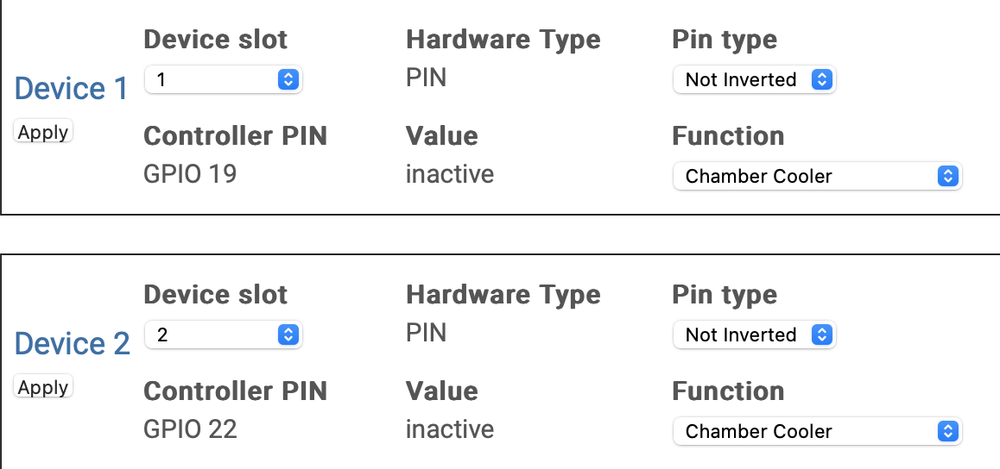

# General

BrewPiLess can run on many different Sonoff devices. You will need to solder the header pins for the first flashing and install temperature sensors.

## Sonoff Basic, Sonoff TH10/16

Sonoff Basic and Sonoff TH10/16 use an ESP8266. Because of the small 1M byte flash memory, you will either sacrifice

* OTA web update for log storage, or
* 500k log storage for OTA update

LCD is not available.

Sonoff Dual is not supported, because the Relays are controlled by Serial instead of GPIO. Instead, SONOFF Dual **R2** should work by specify correct PINs.

Please note that some older SONOFFs, maybe before 2018, use ESP8266 while new ones use ESP8285. Right configuration must be used.

## Sonoff TH Elite, Sonoff TH Origin

Sonoff TH Elite and Sonoff TH Origin use an ESP32.

For Sonoff TH Elite the built-in LCD display can be removed and a OLED LCD screen can be connected in its place. Use electrical tape to make sure that the LCD pcb is not touching the main pcb. The front glass is a thin plastic be gentle with it.

### Relay pins

* 16A devices (THR316 and THR316D): 21
* 20A devices (THR320 and THR320D): 19 (SET) and 22 (RESET)

The 20A devices use a latching relay that requires two pins to set and reset the relay. Configure both pins 19 and 22 for the specific function.

### Connecting sensor

The sensor that has the RJ9 connector comes with a controller in the wire that needs to be removed:

* Option 1: Remove the controller and reconnect the wires.
* Option 2: Use `Sonoff AL010 2.5mm Audio Jack to RJ9 Adapter` with the old sensor using the audio jack conntector.

### Connecting OLED LCD (optional)

1. Connect SDA to WR solder pad.
1. Connect SCL to CS solder pad.
1. Use hotglue over soldered contacts so that you don't ripoff the solder pads accidentally.
1. Connect 3V and GND to corresponding solderpads.
