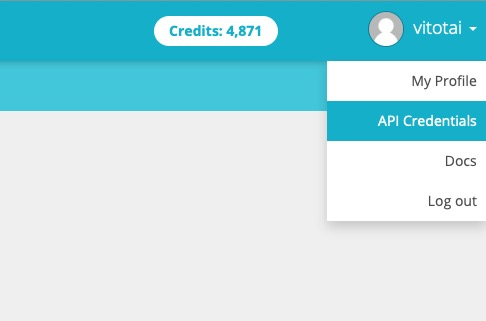

You can find the "token" value in your account and the "device" API label in the device page.

Default token should work.

Please note that ubidots.com rejects null values. Using Generic HTTP format works differently and might not work as expected unless you are sending values that never be invalid. BeerSet will be invalid in fridge constant mode. Gravity value isn't always available.
