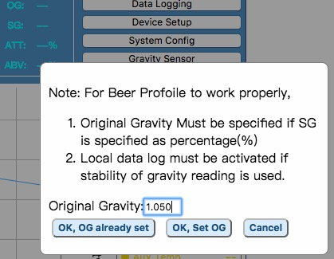
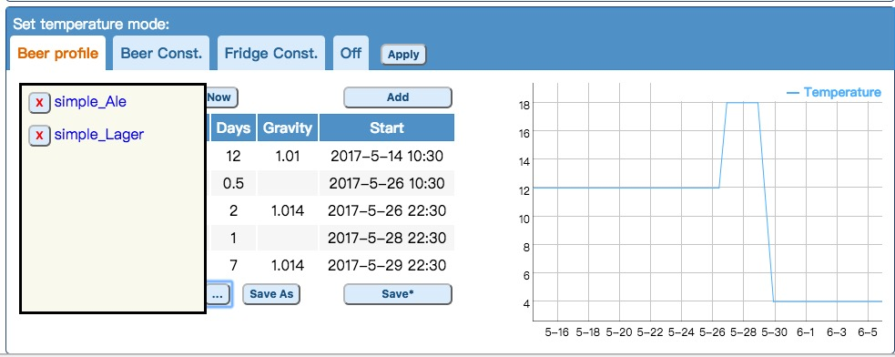

A beer profile is specified by a series of temperature stages. There are two types of temperature stages,
 ***hold*** and ***ramp***. In ***hold*** stage, the temperature is controlled at the specified temperature until the specified condition meets. 
 
 In ***ramp*** stage, the temperature changes *gradually* toward the next stage. A ***ramp*** stage will be automatically inserted between two ***hold*** stages. 
 Only the time, in unit of day, can be specified for a ***ramp*** stage.

Three conditons and their combinations can be used to specify the condition for a ***hold*** stage to finish.
* Time(Days)

    Time is specified in unit of day. Time must be specified no mater what kind of condition is specified. It servers two purposes: for drawing the temperature 
    chart and guestimate of current stage under certain conditions.
* Gravity(SG) 

    The condition meets when the gravity reading is ***less than or equal to*** the specified value. The value can be specified as absolute values like 1.012 or percentage of attenuation like 70%. If percentage of attenuation is used, the original gravity must be specified before applying the beer profile.
* Stable reading of gravity(Stable)

    It is specified in unit of hour. Maximum value is **72**. The definition of "stability" is when the difference between the lastest gravity reading and previous gravity reading is less to or equal to a threshold, default to 1. Set this threshold value in the `Gravity Sensor` setting page. To specify a specific value of ponts, use the notation: `Gravity@Hours`. For example, the condition of `4@48` will meet when the gravity change is less than or equal to (<=) 4 in 48 hours.

It is recommended to use other condition with stable gravity reading condition. The fermentaton usually kicks off after a period of lag. The lag usually takes from 10 hours to 24 hours. During lag time, the reading is stable.

**Note:**
1. In "Brew and Calibrate", the gravity is calculated by Javascript, the browser. Before v2.6, the controller, BPL, has information of tilt values and _REAL_ gravity readings input. The gravity readings that you manual input is used in the decision of beer profile. After v2.6, the formula will be updated to the controller automatically, you will be able to see the latest formula in Gravity Device page.
2. The values used by beer profile are *filtered* values. 
3. Attunation percentage is supported for convenience of profile reuse. 
The real condition is based on gravity reading by simply multiplying the percentage to the original gravity. 
The computation is done when the profile is "loaded". Changing the OG after "applying or saving" beer profile has no effect on beer profile. 

## Saved Beer Profiles

Use `Save As` button to save the edited profile. The saved name should not contain special characters.

Use `...` button next to `Save As` button to open and close the profile list. After loading the profile by clicking it on the list, you have to **Save** it before **Apply**ing it.

