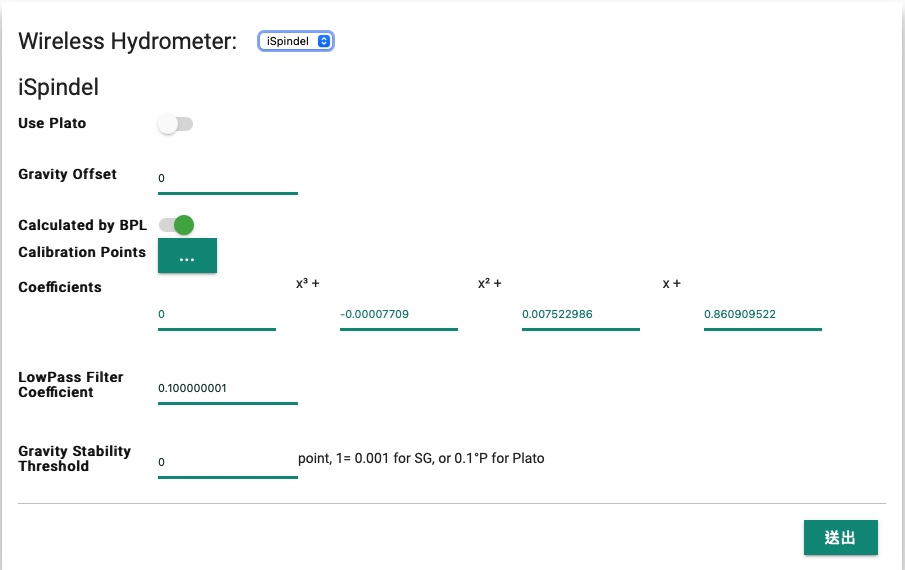
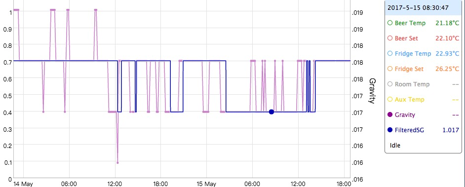
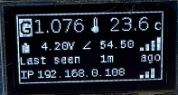

### Connection setup for iSpindel

BrewPiLess supports iSpindel by accepting data from iSpindel and acting an **AP** for iSpindel to connect to, BrewPiLess and iSpindel can connect to the same router. 
To support **softAP**, set the correct settings in `System configuration`. Please note that the password(passphrase) should be at least **8** characters. The same password(pass phrase) is used for setting and for connection certification. Default value is `brewpiless`.

| Setting   | Description       |
| -------------- |:---------------------------------|
| iSpindel         | To enable iSpindel support.   	   |
| Offset          | the offset between reported gravity and "real" gravity" |
| Calculated by BPL | Do the conversion from tilt angle to gravity by BrewPiLess. If this option is OFF, all the following options are not used. |
| Calibration points   | Calibration data. |
| Coefficients | The coefficients of the formula to calculate gravity. The formula is derived based on calibration points. It is not editable. |
| LowPass Filter Coefficient | 0~1. See following description|
| Gravity Stability Threshold | Integer value. 1 point = 0.001.  |

Offset will be "added" to reported gravity to derive the result gravity. If calculated by BPL is enabled, offset is ignored. To enable calculation, at least two points of calibration points should be entered. 

After version 4.4, the calibration data survives through brews. The coefficients(formula) is derived from the calibration data.

### iSpindel Settting
 * Select `Generic HTTP`
 * Server address set to `192.168.4.1` if iSpindel connect to the AP created by BrewPiless. or use the ip of BrewPiless if iSpindel connects the AP that BrewPiLess connects to.
 * set url to `/gravity`

BrewPiLess accept post if it contains the following keys/values:
- name
- temperature
- angle
- RSSI
- gravity

For other iSpindel setting, like network settting, please refer to iSpindel project.

### About low Pass Filter

The coefficient defines the 'a' in this LPF:
y = y[i-1] + a ( x - y[i-1] )
It is usually set to 1/f. So, 1/60 for one minute reporting period, and 1/6 for 10 minute reporteing period.

[calibrationSG.htm in /extra folder](extra/calibrationSG.htm) is an utility HTML file which can be used to derive the coefficients instead of using the excel from iSpindel.

### iSpindel Dedicated Display

The information displayed are
 * 1st line: SG and tempemperature
 * 2nd line: battery, tilt value, and WiFi signal strength of iSpindel
 * 3rd line: time since last seen
 * 4th line: IP address and WiFi singal strenth of BPL