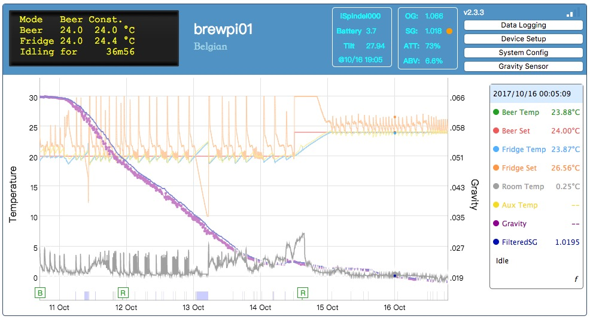
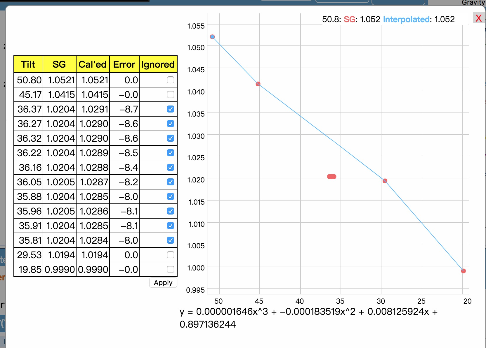

If this feature is enabled, BPL will record the TILT angles from iSpindel, expect the gravity data from user, and derive formula to calculate the gravity automatically. The procedure to use "Brew and Calibrate" is

0. Setup iSpindel to make it report to BPL.
1. Get the **Tilt value in water**, and the reading of your hydrometer or the temperature of the water. Also measure the Original Gravity as usual.
3. Drop iSpindel into the fermenter after carefully sanitizing it.
4. Start local logging with **"Calibrate iSpindel"** enabled. Enter the _reading of the hydrometer_ in the hydrometer, **or** enter the _temperature_ of the water and the _calibration temperature_ of the hydrometer to let BPL derive the reading.

5. [Input SG](ManualGravityInput.md), which is the value of Original Gravity. Note: You should usually input the same value as OG. That is, you have to input the same data for OG and SG.( OG is not necessarily the starting SG of current log, so BPL won't automatically add a gravity data for you.)

7. Measure SG as usual or more frequently. Input the measured SG.

BPL will derive the formula by the Tilt values and gravity data input. If the number of data pairs is less than 3, then linear(x) formula is used. Second order polynomial(x^2) will be derived if the number of pairs is equal to 3. If 4 or more gravity readings are available, 3 order polynomial will be derived. At the beginning, there should be two readings, 1.0 and OG. Even though you can't expect precise and correct gravity readings from the chart from the beginning, the change of gravity can be deduced by the change of Tilt values.

*Note: The formula coefficients might be different from the value input or calculated. It is due to the precision of float point. The difference of calculated gravity should be within 0.0001. Therefore, it should be fine.*

If BPL is in calibrating mode, there will be a lower case "f" at the bottom of the legend block. Click the "f" will bring out the calibration points and formula used.

Check the checkbox of "ignore" if that set of data is erroneous. BPL will derive a new formula based on updated data. Press "Apply" to re calculate all gravity based on new formula. Note that at least two set of data should be left "un"-ignored. At least two set of data is necessary to derive a valid formula.

Please note that the maximum number of data set is **21**. Tilt and gravity data set beyond 21 can't be ignored.

