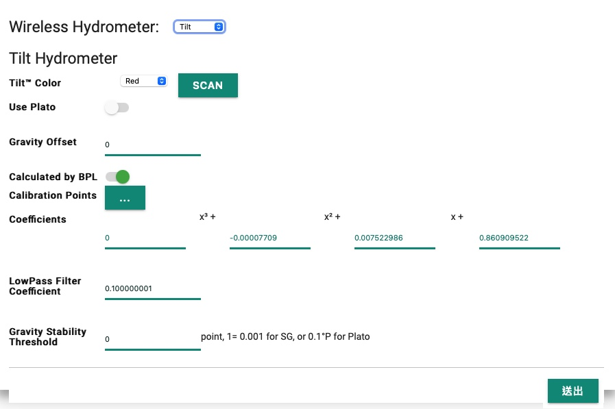

# Tilt Hydrometer
[Tilt Hydrometer](https://tilthydrometer.com) broadcasts gravity and temperature in format of iBeacon. ESP32, built in BLE, can receives the iBeacon message and hence supports Tilt Hydrometer, provided close enough for BLE signal.

Tilt hydrometer and iSpindle are exclusive. ESP8266 doesn't support BLE, and setting Tilt Hydromenter Enabled will be rejected.

## Using Tilt tempeerature as Beer Temperature
It is possible, by assining "External Sensor" to Beer Temperature. However, it is not recommeded. Tilt broadcasts temperature in integer Farenheit format. The precision won't do a good job in temperature control.