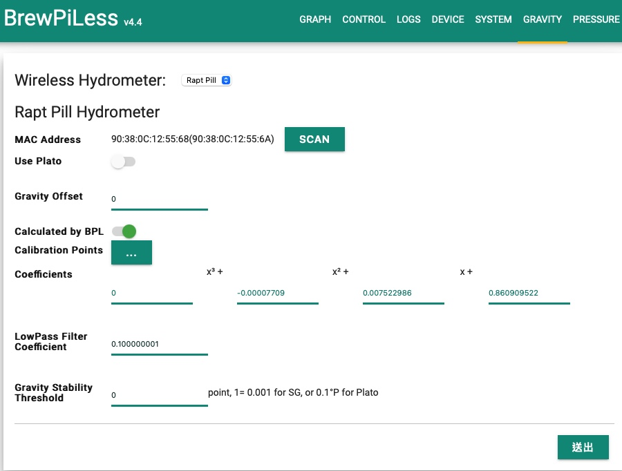

# Rapt Pill Hydrometer

[Rapt Pill](https://www.kegland.com.au/products/yellow-rapt-pill-hydrometer-thermometer-wifi-bluetooth) utilizes the same principle as Tilt and iSpindel. When set Bluetooth/BLE mode, BrewPiLess running on ESP32 can read the bluetooth broadcast informaton.

Pill broadcasts gravity and tilt angle related information, which make it possible to run "brew and calibrate" like iSpindel.

| Setting   | Description       |
| -------------- |:---------------------------------|
| Mac Address  | MAC used for registration and real MAC address   	   |
| use Plato    | Plato or Specific Gravity(eg. 1.054) |
| Gravity Offset          | the offset between reported gravity and "real" gravity" |
| Calculated by BPL | Do the conversion from tilt angle to gravity by BrewPiLess. If this option is OFF, all the following options are not used. |
| Calibration Points   |  Calibration data. At least two set of data is necessary. |
| Coefficients | The coefficients of the formula to calculate gravity. The formula is derived based on calibration points. It is not editable.|
| LowPass Filter Coefficient | 0~1. See following description|
| Gravity Stability Threshold | Integer value. 1 point = 0.001.  |

Offset will be "added" to reported gravity to derive the result gravity. If calculated by BPL is enabled, offset is ignored. To enable calculation, at least two points of calibration points should be entered. 

After version 4.4, the calibration data survives through brews. The coefficients(formula) is derived from the calibration data.

The MAC address used for registration and displayed on Rapt Pill's Dianostics page is calculated by taking the RAPT Pill's BLE address and subtracting 2 off the last octet. Therefore, thare are TWO addresses displayed.

To find out Pills, click "Scan" button. The Pills don't broadcast all the time but wakeup and broadcast for a short period according its setting, like one or 15 minutes. It might take some time to "catch" the Pill, wait until the Pill shows up.

Pills report gravity as well as tilt information. If "Calculated by BPL" is enabled, the gravity is derived from the tilt information. Otherwise, the gravity from Pills will be used. The offset will be added to reported gravity. If "Calculated by BPL" is enabled, at least two sets of calibration data is necessary to derive a formula. Before a valid formula is available, no gravity data will be reported. The calibratin data will survives through brews. If the center of mass of the Pill is altered when opened for charging, the calibration data should be removed manually. 