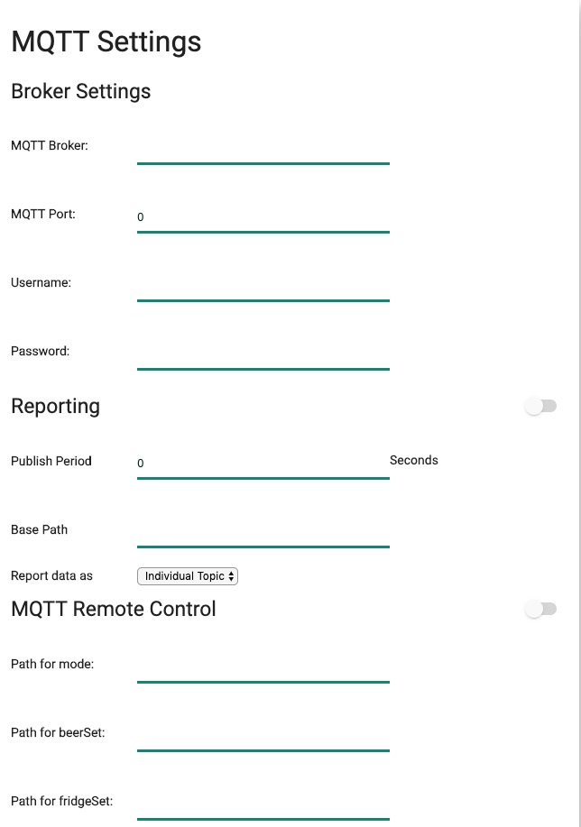

BPL supports MQTT reporting(publish) and remote control(subscribe). 

MQTT reporting is independent from HTTP reporting/logging. You can enable both at the same time. However, it is not recommended because of resource consumption.

## Broker/Server Settings
The commmon seection of Reporting and Remote Control.
Please note that BPL doesn't support SSL.
## Reporting format
The data can be sent in two ways, "**Individual Topic**" and "**Whole as JSON**". 
When "**Individual Topic**" is selected, in most cases, every data item has its own topic, appended after "**Base Path**". For example, the topic of beerTemp will be "`/base/beerTemp`", given the "Base Path" is "`/base`".

Ubidots.com accepts JSON format as MQTT data publish, which is the case that "**Whole as JSON**" should be used.

The topic terminals or the JSON labels are listed in the following table.

| Label            | Meaning       | Note       |
| -------------- |:-------------:| :--------------------|
| beerTemp | Beer Temperature reading | |
| beerSet |  Beer set temperature| |
| fridgeTemp | Fridge Temperature reading |
| fridgeSet |  Fridge set Temperature| |
| roomTemp |  Room temperature| |
| gravity | Gravity in SG(eg. 1.052) | |
| plato | Plato | |
| auxTemp | Temperature reading from iSpindel | |
| voltage | Voltage of iSpindel| |
| tilt | Tilt value of iSpindel | |
| pressure | Pressure reading in PSI | |
| mode |  current running mode| Integer values for "**Whole as JSON**", character values for "**Individual Topic**" |
| state | State in Integer. 0:IDLE, 1:STATE_OFF,2: DOOR_OPEN, 3:HEATING, 4: COOLING, 5: WAITING_TO_COOL, 6:WAITING_TO_HEAT, 7:WAITING_FOR_PEAK_DETECT, 8:COOLING_MIN_TIME, 9:HEATING_MIN_TIME |
| fridgeHumidity | Fridge/Chamber Humidity reading, if available |
| roomHumidity   | Room/environment Humidity reading, if available |

## MQTT Remote Control
MQTT Remote Control enables controlling BPL by a MQTT server. When enabled, BPL subscribes the specified path and changes the setting accordingly.
Currently, five items can be controlled in this way.
#### Mode
The values can be 0,1,2,3 or o,f,b,p for 'Off', 'Fridge Constant', 'Beer Constant', and 'Beer Profile'.
If the mode is changed to 'Beer Profile', the current profile will be used and the profile starting time will be set to current time. That is, you should edit the profile beforehand, and expect the profile to be execute starting from the time it is set.

### beerSet
Beer setting temperature. It is used it the mode is set to "Beer Constant".

### fridgeSet
Fridge setting temperature. It is used it the mode is set to "Fridge Constant".

### Capping/spunding, if enabled.
### PTC temperature, if enabled
To set PTC target temperature, the 'triggering temperature' will set to 3 degree higher.

## Initial values and Echo effect
While **mode**, **fridgeSet**,  and **beerSet** are reporting items, they are also "subscribed" topics if enabled. They can have exact the same topics as reporting topics, or not.
If the "Remote Control" topics are different from "Reporting" topics, the initial values are not clear, or undefined. For example, if "/basepath/setmode" is the remote control path and "/basepath/mode" is reporting path. The initial value of "/basepath/setmode" is undefined. It won't affect normal operation, but some people don't like it.
If the remote control topic path is set to exact the same as reporting topic, echo effect happens when changing the values, depending on the implementation of MQTT Brokers. It is demostrated as following table.

| BPL            | MQTT Broker       | User       |
| -------------- |:-------------:| :--------------------|
| BPL publishes mode, say, OFF. | | |
|  | MQTT Broker publishes mode to value OFF | |
| BPL gets notification that mode is changed to OFF. | | |
| | | |
| | | The user sets mode to "beerConst". |
| | Broker notifiy value changes |  |
| BPL updates mode to beerConst. | | |
| BPL reports mode as beerConst| | |
| | Broker notifiy value changes |  |
| BPL gets notification that mode is changed to beerConst. | | |

## Some Notes
Connecting to MQTT server takes up a TCP connection and some resource. The program might stick to the setting on MQTT server. Therefore, enable it only when you need it.

There is latency of network and update of data. Therefore, expect some delay after changing the setting.

***
[Settings for ubidots.com](MQTT.ubidots.md)
