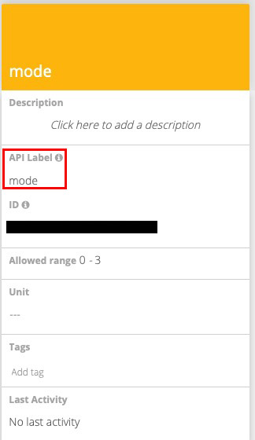
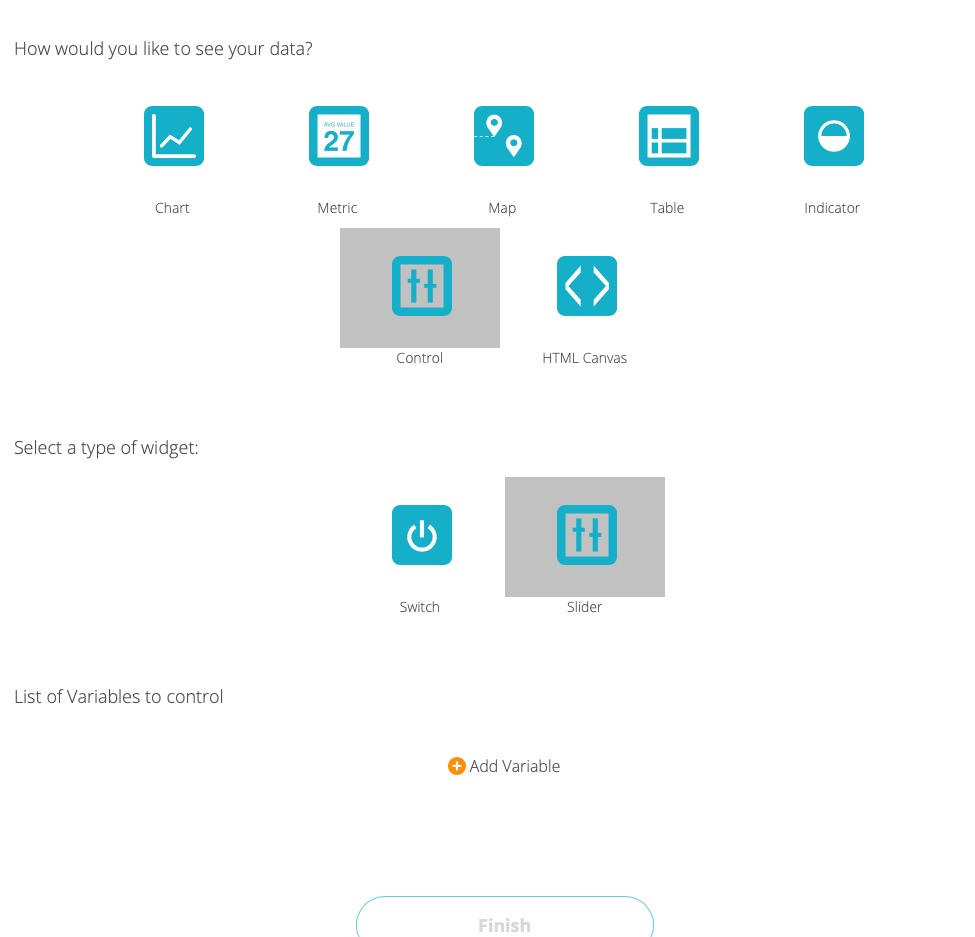
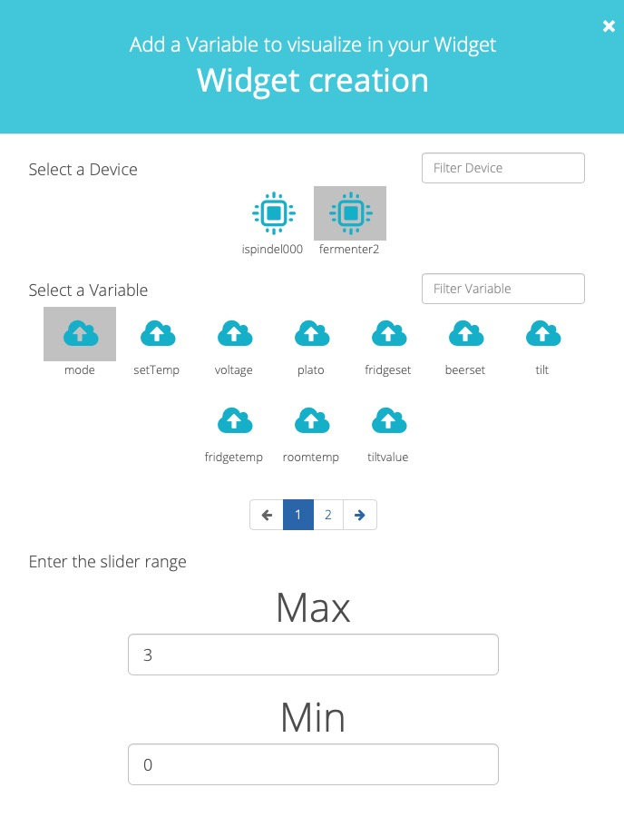
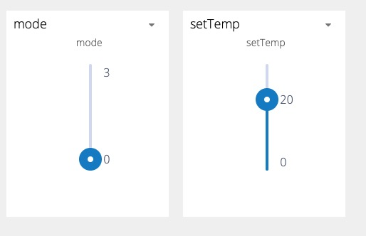

# MQTT Settings of ubidots.com
### Step 1. create variables
Go to the device page, add variables,say "mode" and "settemp".

Make sure the "api label" is correctly set.

### Step 2. create controls
Go to dashboard. Click "+"(Add widget) to add a **slider** control:

Choose the just added variable, mode:
Set the range 0-3, while 0 is off, 1 is "Fridge Constant", 2 is "Beer Constant", and 3 is "Beer Profile".

Do the same to the "settemp" variable with correct ranges.

Now you will have it.

## Settings for ubidots.com
Get the full information from [Ubidots Docs](https://ubidots.com/docs/hw/#mqtt).

For free/educational users, use
* MQTT Server: things.ubidots.com
* MQTT Port : 1883
* User Name: [ubidots token]
* Password: (left blank)

The path is in format of '/v1.6/devices/{DEVICE_LABEL}/{LABEL_VARIABLE}/lv'.
Let the device label be 'fermenter2' and mode and setting temperature variables be 'mode', and 'settemp'.
* Mode path: /v1.6/devices/fermenter2/mode/lv
* beerSet or fridgeSet path: /v1.6/devices/fermenter2/settemp/lv

## Usage

Slide the **mode slider** to change mode and **settemp slider** to change temperature. 